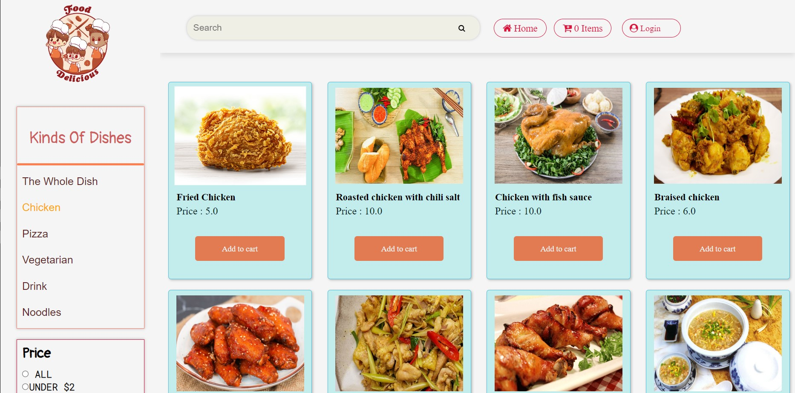

# FOOD SHOP ONLINE

## Members

- Trinh Huu Tuan
- Nguyen Ngoc Tuan

## Website Name

3Yumi

## Purpose

The purpose of the FoodShopOnline website is to provide a convenient and user-friendly platform for customers to browse, select, and purchase various food items offered by the shop.

## Target Users

The website primarily caters to customers who are looking to order food items from the shop online. This can include local residents, office workers, and anyone interested in purchasing food items from the shop.

## Systems

- Customer system
- Admin system

## Features

### 1. Customer System

- **Login and Logout:**
  - The "Login" function in the website allows users to authenticate and access their personal accounts with an account and password.
  - The "Log Out" function on the website allows users to log out of their personal accounts and end the current session.

- **Product Catalog:**
  - Design and develop a user-friendly interface to display food items.
  - Categorize food items into sections like appetizers, main courses, desserts, etc.
  - Include high-quality product images, detailed descriptions, and prices for each item.

- **User Registration and Account Management:**
  - Implement a user registration system where customers can create an account.
  - Store customer profiles in a database, including name, contact information, and delivery address.
  - Allow users to log in using their credentials to access their account.

- **Shopping Cart and Checkout:**
  - Develop a shopping cart functionality that allows users to add items.
  - Display a summary of the items in the cart, including quantities and prices.
  - Provide options for users to review and modify their cart before proceeding to checkout.

- **Search and Filtering:**
  - Create a search feature to help users find specific food items based on keywords.
  - Implement filtering options like price range, cuisine type, dietary restrictions, etc.

- **Product Reviews and Ratings:**
  - Allow registered users to leave reviews and ratings for food items they have purchased.
  - Display an average rating and customer reviews on each product page.

- **Track order status:**
  - "Pending" state: When the user is in this state, the request or process is pending. Users can view previously purchased cart and check the products in it. If the user doesn't want to buy the product anymore, they can cancel the request.
  - "In Progress" state: When the user is in this state, the request or process is in progress. Users can view progress and information about the current process. They can also review the cart and products purchased in the process.
  - "Completed" Status: When the user is in this state, the request or process has been completed successfully.
  - "Cancelled" state: When the user is in this state, the request or process has been canceled and cannot continue. The user can view information about the canceled process and review the cart. If they want to buy the product again, they can go through the purchase process again.

### 2. Admin System

- **Dashboard:**
  - Admin can track sales by date and number of invoices dropped. Can track the best-selling category as well as the revenue each month of the year according to the diagram.

- **Food Item Management:**
  - Enable the admin to add, remove, and update food items in the catalog.

- **User Account Management:**
  - Provide functionality to manage user accounts, view customer details.

- **Order Tracking and History:**
  - Implement order tracking functionality so that customers can track their order status.
  - Maintain an order history for customers to refer to past purchases and order details.

## Technology

- HTML
- CSS
- JavaScript
- Java web

## Wireframe

**USER**
- Welcome Website:

- Login/Register:

- View:

- Search: 

 
 
 - Category:
 

 - Price:
 

- Deatil: 

- With Login: 

- With No Login:

- Top Disher: 

 - Cart:   
 

-Add to cart success/out stock: 

- Check out: 

 

- Order status:

- View in purchase: 

)

**ADMIN**
- Login :
  
  

- DashBoard: 

- Product: 

 - Create Product/ Update Product / Search Product 
 

-OutStock Product/Search outstock product: 

- Admin / Search admin : 

-Order/Search Order: 

- Detail Order: 

## Database System 

## System Design

The system of User and Admin Web is designed following the MVC Pattern.
- The MVC2 (Model-View-Controller 2) pattern is a software architecture based on the MVC model and is commonly used in web applications using JavaServer Pages (JSP) or similar technologies. It consists of three main components:

Model: Represents the data and business logic of the application, often implemented as a Plain Old Java Object (POJO) or related to database access.

View: Represents the user interface (UI) of the application, displaying data from the model and interacting with users through JSP or HTML.

Controller: Handles user requests, coordinates the flow of the application. It is usually implemented as a servlet or Java class, which calls the model and selects the appropriate view to respond to users.

- We developed the project with 2 separate websites. Every website applies the MVC model.

**User**

- View
  

- Controller
  

- Model
  

**Admin**

- View
  

- Controller
  

- Model

## Conclusion

**Pros:**
- Provides convenient operations to support users and administrators.
- Covers essential functionalities for online food shopping.
- Business logic is clear.

**Cons:**
- Our code and system design is still not clean.
- The interface design could be improved.
- Elimated the functions.
- We have a few advanced functions.
- **What we learned during application development:**

- Huu Tuan: I learned the basics of backend development and using GitHub. Additionally, I gained experience in working with a team, managing time, organizing group work, and designing a web system. This small exercise contributed to my overall development, and I appreciate the support of my teammates and teachers.

- Ngoc Tuan: The project exceeded my expectations. I gained valuable experiences in time management, teamwork, problem-solving, and a sense of responsibility at work. I am proud of working with my teammate, and although the website may not meet all market demands, it is a meaningful achievement for both of us. I am thankful for this group exercise and the support of my teammate throughout the project.

**Future app improvements:**

- Code reorganization and cleaning.
- Addition of advanced functions like suggestions, favorites, picture tracking, electronic payments, etc.
- Further development and expansion of the application.
